# Blockscout Tor Hidden Service Bridge

[](https://github.com/igor53627/blockscout-onion/actions/workflows/ci.yml)

A lightweight, production-ready setup to expose any HTTP service as a Tor hidden service (.onion address) using Docker Compose. This repository demonstrates exposing a remote Blockscout instance, but can be adapted for RPC providers, static dApp websites, indexer servers, or any HTTP-based service.

## Architecture Flowchart

```mermaid
flowchart TD
    A["👤 Tor Browser User"] -->|".onion request"| B["🌐 Tor Network"]
    B -->|"Routes traffic via<br/>Tor hidden service protocol"| C["🐳 Tor Container<br/>(Port 80)<br/>━━━━━━━━━━━━━━<br/>Runs tor daemon<br/>Manages .onion address"]
    C -->|"Forwards to internal network"| D["🐳 Nginx Container<br/>(Port 8080)<br/>━━━━━━━━━━━━━━<br/>Reverse proxy<br/>HTTP traffic handler"]
    D -->|"HTTP proxy request"| E["🌍 Remote Service<br/>━━━━━━━━━━━━━━<br/>Blockscout: 5.9.87.214:80<br/>or RPC Provider: :8545<br/>or any HTTP service"]

    E -->|"Response"| D
    D -->|"Response"| C
    C -->|"Via Tor network"| B
    B -->|"Response"| A
```



## Features

- **Simple Architecture**: Separate Tor and Nginx containers for better isolation
- **HTTP-Only Design**: Lightweight setup without HTTPS certificate management overhead
- **Single-Hop Mode**: Optimized for speed when service anonymity is not required
- **Universal**: Works with any HTTP service (RPC providers, dApps, indexers, APIs)
- **Persistent Keys**: Supports using existing .onion addresses
- **Production-Ready**: Automatic restarts, health checks, and proper logging
- **Security-Focused**: Explicitly disables exit relay and control port to prevent abuse
- **CI/CD Ready**: GitHub Actions workflow for automated testing ([see CI.md](CI.md))

## Why This Approach?

### HTTP vs HTTPS
This setup uses **HTTP** between containers and to the upstream service because:
- No certificate management complexity
- Lower overhead and resource usage
- The Tor network already provides end-to-end encryption
- Perfect for development and services where the backend is trusted

### Single-Hop Mode Performance
This setup is configured with:
```
HiddenServiceSingleHopMode 1
HiddenServiceNonAnonymousMode 1
```

**Why use single-hop mode?**
- **Speed**: Reduces circuit from 6 hops (3+3) to 3+1 hops, significantly lowering latency
- **On-par with exit nodes**: Similar speed to using a Tor exit node, but...
- **No exit node censorship**: Your service can't be blocked by exit node operators
- **No eavesdropping**: Unlike exit nodes, no third party can intercept traffic
- **Use case**: Ideal when you want Tor's censorship resistance without needing location anonymity

**Trade-off**: The server's IP address may be exposed to determined adversaries. Only use this mode if you don't need to hide the server's physical location.

### Security: Exit Relay & Control Port Disabled
```
ORPort 0          # No relay functionality
ExitRelay 0       # Not an exit node
ExitPolicy reject *:*
SocksPort 0       # No SOCKS proxy
```

This prevents:
- Your server from being used as a Tor relay (bandwidth abuse)
- Exit node liability (illegal content routing through your IP)
- Unauthorized access via SOCKS proxy
- Control port exploitation

## Comparison with OnionSpray

[OnionSpray](https://gitlab.torproject.org/tpo/onion-services/onionspray) is an official Tor Project tool designed for production-grade hidden service deployments. It's a comprehensive Python-based framework that handles complex scenarios like load balancing across multiple backend servers, managing multiple hidden services simultaneously, and sophisticated traffic routing. OnionSpray is ideal for organizations running large-scale infrastructure where reliability and redundancy are critical.

For simpler use cases where you need to expose a single HTTP service via Tor, this Docker Compose setup provides a more lightweight and maintainable alternative.

| Feature | This Setup | OnionSpray |
|---------|-----------|------------|
| **Complexity** | Simple Docker Compose | Comprehensive framework |
| **Dependencies** | Docker only | Python, additional tools |
| **Use Case** | Single service proxying | Multiple services, load balancing |
| **Setup Time** | < 5 minutes | Longer configuration |
| **Customization** | Direct file editing | Configuration system |
| **Best For** | Quick deployments, single services | Enterprise, multi-service setups |

**When to use this setup**: You want a simple, maintainable solution for exposing one HTTP service via Tor.

**When to use OnionSpray**: You need advanced features like load balancing, multiple hidden services, or complex routing.

## Directory Structure

```
blockscout-onion/
├── Dockerfile.tor         # Tor container image
├── Dockerfile.nginx       # Nginx container image
├── docker-compose.yml     # Docker Compose configuration
├── torrc                  # Tor configuration
├── nginx.conf             # Nginx proxy configuration
├── entrypoint-tor.sh      # Tor startup script
├── public/                # Screenshots for documentation
│   ├── blockscout.png
│   └── status.png
├── tor_data/              # Persistent Tor data (auto-created)
│   └── hidden_service/    # Hidden service keys
│       ├── hostname       # Your .onion address
│       ├── hs_ed25519_public_key
│       └── hs_ed25519_secret_key
└── README.md
```

## Quick Start

### 1. Clone and Configure

```bash
git clone <your-repo-url>
cd blockscout-onion
```

**To proxy a different service**, edit `nginx.conf`:
```nginx
upstream blockscout {
    server your-service.com:8545;  # Change to your service
}
```

### 2. (Optional) Use Existing .onion Keys

If you have existing hidden service keys:

```bash
mkdir -p tor_data/hidden_service
cp /path/to/your/hs_ed25519_public_key tor_data/hidden_service/
cp /path/to/your/hs_ed25519_secret_key tor_data/hidden_service/
cp /path/to/your/hostname tor_data/hidden_service/
chmod 700 tor_data/hidden_service
chmod 600 tor_data/hidden_service/*
```

If you don't have keys, Tor will generate new ones automatically.

### 3. Build and Start

```bash
docker-compose up -d --build
```

### 4. Get Your .onion Address

```bash
# Wait a moment for Tor to bootstrap, then:
cat tor_data/hidden_service/hostname
```

Example output:
```
7lxb5y5sikmt4nmsm37yq567q3zazgsxmyapjs7azssoaojxna6kftid.onion
```

### 5. Test Access

Open Tor Browser and visit:
- Main service: `http://your-address.onion`
- Status page: `http://your-address.onion/status`

## Documentation

- **[Troubleshooting Guide](docs/TROUBLESHOOTING.md)** - Debugging, logs, common issues
- **[Management Commands](docs/MANAGEMENT.md)** - Start, stop, restart, monitor
- **[Configuration Guide](docs/CONFIGURATION.md)** - Customize Tor, Nginx, Docker settings
- **[Backup Guide](docs/BACKUP.md)** - Backup and restore your .onion keys

## Quick Reference

### Essential Commands

```bash
# Start service
docker compose up -d

# View logs
docker compose logs -f

# Get .onion address
cat tor_data/hidden_service/hostname

# Check status
docker compose ps

# Stop service
docker compose down
```

For detailed commands, see [Management Guide](docs/MANAGEMENT.md).

## Generating a Vanity .onion Address

Vanity addresses are custom .onion addresses with a recognizable prefix (e.g., `blockscout...onion`).

**Important**: Vanity address generation can take hours to weeks depending on the desired prefix length. We **strongly recommend** running the generation process in a terminal multiplexer like `tmux` or `screen` to prevent interruption if your SSH session disconnects or your terminal closes.

```bash
# Start a tmux session
tmux new -s vanity-gen

# Or use screen
screen -S vanity-gen

# Run your vanity generation command here
# Detach with: Ctrl+b, then d (tmux) or Ctrl+a, then d (screen)
# Reattach with: tmux attach -t vanity-gen (or screen -r vanity-gen)
```

### Benefits
- **Memorable**: Easier for users to remember and recognize
- **Branding**: Reinforces your project identity
- **Trust**: Users can verify they're on the correct service
- **SEO**: More shareable and professional

### Tools

#### Option 1: onionmine (Recommended)
Official Tor Project tool: [gitlab.torproject.org/tpo/onion-services/onionmine](https://gitlab.torproject.org/tpo/onion-services/onionmine)

```bash
# Install (requires Rust)
git clone https://gitlab.torproject.org/tpo/onion-services/onionmine.git
cd onionmine
cargo build --release

# Generate address with prefix "block"
./target/release/onionmine --prefix block -n 1

# The more characters, the longer it takes:
# 5 chars: ~30 seconds
# 6 chars: ~15 minutes
# 7 chars: ~8 hours
# 8 chars: ~2 weeks (on fast CPU)
```

#### Option 2: mkp224o
High-performance alternative: [github.com/cathugger/mkp224o](https://github.com/cathugger/mkp224o)

```bash
# Install
git clone https://github.com/cathugger/mkp224o.git
cd mkp224o
./autogen.sh
./configure
make

# Generate with filter
./mkp224o block -d ./keys -n 1

# Use all CPU cores
./mkp224o block -d ./keys -n 1 -t $(nproc)
```

### Performance Tips
- **Use a high-CPU machine**: Generation is CPU-bound (cloud instances, dedicated servers)
- **Parallel generation**: Run multiple instances with different filters
- **Cloud burst**: Use temporary high-CPU cloud instances (AWS c7i, Azure F-series)

### Using Generated Keys

After generation, copy the keys to your setup:

```bash
# Keys will be in a directory named with your .onion address
cp keys/your-vanity-address.onion/* tor_data/hidden_service/
chmod 700 tor_data/hidden_service
chmod 600 tor_data/hidden_service/*

# Restart to use new address
docker-compose restart
```

## Security Considerations

### What This Setup Provides
- Censorship resistance via Tor network
- No reliance on potentially malicious exit nodes
- End-to-end encryption through Tor
- Isolated containers for Tor and Nginx

### What This Setup Does NOT Provide
- Server location anonymity (single-hop mode exposes IP)
- DDoS protection (consider Cloudflare → Nginx → Tor for this)
- Rate limiting (add to nginx.conf if needed)

### Recommendations
- **Backup your keys regularly**: See [Backup Guide](docs/BACKUP.md)
- **Monitor logs** for suspicious activity: See [Troubleshooting Guide](docs/TROUBLESHOOTING.md)
- **Keep containers updated**: See [Management Guide](docs/MANAGEMENT.md)
- **Customize configuration**: See [Configuration Guide](docs/CONFIGURATION.md)

## Use Cases

This setup is perfect for:
- **RPC Providers**: Expose Ethereum/Bitcoin nodes via Tor (e.g., port 8545)
- **Blockchain Explorers**: Like this Blockscout example
- **Static dApps**: Censorship-resistant frontends
- **Indexer APIs**: GraphQL endpoints, REST APIs
- **Development Services**: Testing apps over Tor
- **Mirror Services**: Provide Tor access to existing HTTP services

## Contributing

Contributions are welcome! Please feel free to submit a Pull Request.

For information about the automated testing setup, see [CI.md](CI.md).

## License

Licensed under either of:

- Apache License, Version 2.0 ([LICENSE-APACHE](LICENSE-APACHE) or http://www.apache.org/licenses/LICENSE-2.0)
- MIT license ([LICENSE-MIT](LICENSE-MIT) or http://opensource.org/licenses/MIT)

at your option.

### Contribution

Unless you explicitly state otherwise, any contribution intentionally submitted for inclusion in the work by you, as defined in the Apache-2.0 license, shall be dual licensed as above, without any additional terms or conditions.

## Resources

- [Tor Project: Onion Services](https://community.torproject.org/onion-services/)
- [Tor Project: OnionSpray](https://gitlab.torproject.org/tpo/onion-services/onionspray)
- [Tor Metrics](https://metrics.torproject.org/)
- [Vanity Address Generator: onionmine](https://gitlab.torproject.org/tpo/onion-services/onionmine)
- [Vanity Address Generator: mkp224o](https://github.com/cathugger/mkp224o)
