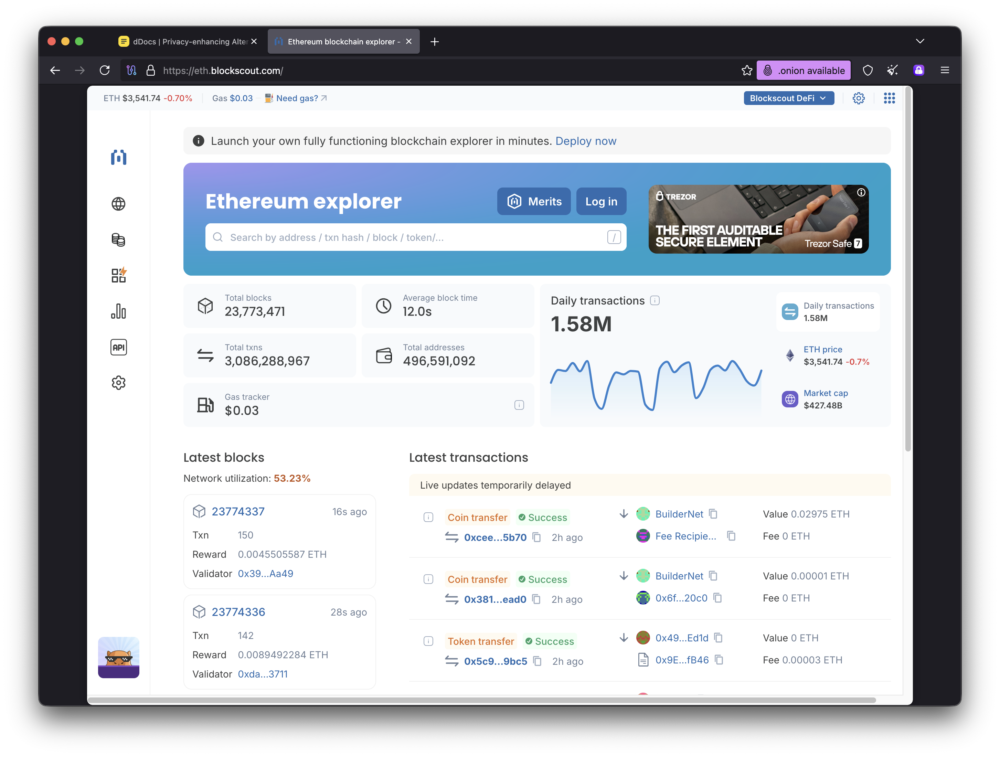

# Onion-Location Header Guide

## Overview

The `Onion-Location` HTTP header is an official mechanism standardized by the Tor Project that allows clearnet websites to advertise their Tor hidden service (.onion) address. When a Tor Browser user visits your clearnet site, they will see a notification prompting them to switch to the more secure and private .onion version.

## What is Onion-Location?

**Onion-Location** is a special HTTP response header that clearnet websites can use to inform Tor Browser users about an available onion service alternative. This feature provides:

- **Automatic Discovery**: Users don't need to manually find your .onion address
- **Security Upgrade**: Encourages use of end-to-end encrypted onion services
- **User Choice**: Non-intrusive notification that lets users decide whether to switch
- **Censorship Resistance**: Even if clearnet site is blocked, users can find the onion address

## How It Works

### User Experience in Tor Browser

1. User visits your clearnet site (e.g., `https://blockscout.com`) in Tor Browser
2. Your server responds with `Onion-Location: http://your-address.onion` header
3. Tor Browser displays a purple onion icon in the address bar with notification
4. User clicks the notification or icon to switch to the .onion version
5. Subsequent visits can automatically use the .onion address (user preference)

### Example Screenshots

The Tor Browser notification looks like this when Onion-Location is enabled:



*Screenshot from eth.blockscout.com showing the purple onion icon and notification in Tor Browser's address bar.*

Place your own screenshots in the `docs/images/` directory for documentation purposes.

## Implementation

### Basic nginx Configuration

Add the `Onion-Location` header to your nginx configuration on your **clearnet server** (not the onion service itself):

```nginx
server {
    listen 443 ssl http2;
    server_name blockscout.com;

    # Onion-Location header - tells Tor Browser about .onion alternative
    add_header Onion-Location http://your-actual-address.onion$request_uri always;

    location / {
        # Your normal configuration...
    }
}
```

**Important Notes:**

- Use `http://` scheme for .onion addresses (not `https://`)
- Include `$request_uri` to preserve the current page path
- Use `always` flag to include header in error responses too
- Only add this header to your **clearnet deployment**, not the onion service

### For This Project's Architecture

This project creates the **onion service** infrastructure. To use Onion-Location:

1. **Deploy this project** to create your .onion hidden service
2. **Get your .onion address** from `tor_data/hidden_service/hostname`
3. **On your clearnet server** (separate infrastructure), add the header:

```nginx
# On your clearnet nginx server (e.g., blockscout.com)
server {
    listen 443 ssl;
    server_name blockscout.com;

    # Point Tor Browser users to your onion service
    add_header Onion-Location http://7lxb5y5sikmt4nmsm37yq567q3zazgsxmyapjs7azssoaojxna6kftid.onion$request_uri always;

    # Your clearnet configuration...
}
```

### Testing the Configuration

To test if Onion-Location is working:

```bash
# Test clearnet server response (replace with your domain)
curl -I https://your-clearnet-site.com | grep -i onion-location

# Expected output:
# Onion-Location: http://your-address.onion/
```

### Advanced Configuration Examples

#### Conditional Onion-Location (Only for Tor Browser)

You can optionally serve the header only to Tor Browser users:

```nginx
server {
    listen 443 ssl;
    server_name example.com;

    # Only recommend .onion to Tor Browser users
    if ($http_user_agent ~* "Tor Browser") {
        add_header Onion-Location http://your-address.onion$request_uri always;
    }

    location / {
        # Your configuration...
    }
}
```

**Note**: The `if` directive has limitations in nginx. For most use cases, always sending the header is recommended (non-Tor browsers ignore it).

#### Multiple Onion Services

If you have different onion services for different subdomains:

```nginx
# Main site
server {
    listen 443 ssl;
    server_name example.com;
    add_header Onion-Location http://main-service.onion$request_uri always;
}

# API subdomain
server {
    listen 443 ssl;
    server_name api.example.com;
    add_header Onion-Location http://api-service.onion$request_uri always;
}
```

## Security Considerations

### Why HTTP for .onion Addresses?

Onion services use the Tor network's end-to-end encryption, making the transport layer inherently secure. Using `http://` for .onion addresses is:

- **Standard Practice**: Tor Project recommendation
- **No Certificate Required**: .onion addresses are cryptographically verified
- **Simpler**: No need for TLS certificate management
- **Equally Secure**: Tor provides encryption at the network layer

### HTTPS for Clearnet

Your **clearnet site** should still use HTTPS with valid TLS certificates:

```nginx
# Clearnet server (HTTPS required)
server {
    listen 443 ssl http2;
    server_name clearnet-site.com;

    ssl_certificate /path/to/cert.pem;
    ssl_certificate_key /path/to/key.pem;

    # Point to HTTP .onion (this is correct!)
    add_header Onion-Location http://your-address.onion$request_uri always;
}
```

### Avoiding Confusion

**DO NOT** add Onion-Location header to the onion service itself:

```nginx
# WRONG: Don't do this on your onion service
server {
    listen 8080;
    server_name your-address.onion;

    # DON'T ADD THIS - would create a loop
    # add_header Onion-Location http://your-address.onion$request_uri;
}
```

The header is only for clearnet → onion direction, not onion → onion.

## Browser Behavior

### Tor Browser Support

- **Tor Browser 9.5+**: Full support for Onion-Location header
- **Notification**: Purple onion icon appears in address bar
- **User Preference**: Users can enable automatic redirects to .onion
- **Privacy**: Onion-Location doesn't leak information (processed locally)

### Other Browsers

- **Chrome/Firefox/Safari**: Ignore the header completely (no effect)
- **Brave**: Has experimental Tor support, may use Onion-Location in future
- **Non-Tor Browsers**: Header is harmless and simply ignored

## Use Cases

### When to Use Onion-Location

- **Public Services**: Blockchain explorers, APIs, documentation sites
- **News/Media**: Censorship-resistant journalism platforms
- **Privacy Tools**: Services that benefit from anonymity
- **Mirror Sites**: Providing Tor access to existing clearnet services

### When NOT to Use Onion-Location

- **Admin Panels**: Keep internal tools separate from public services
- **Development**: Not needed for local testing
- **Onion-Only Services**: If you don't have a clearnet presence
- **High-Security Services**: Where you don't want any clearnet exposure

## Real-World Examples

Several major websites use Onion-Location:

- **DuckDuckGo**: `https://duckduckgo.com` → `http://duckduckgogg42xjoc72x3sjasowoarfbgcmvfimaftt6twagswzczad.onion`
- **ProtonMail**: `https://protonmail.com` → `http://protonmailrmez3lotccipshtkleegetolb73fuirgj7r4o4vfu7ozyd.onion`
- **The New York Times**: `https://www.nytimes.com` → `http://nytimesn7cgmftshazwhfgzm37qxb44r64ytbb2dj3x62d2lljsciiyd.onion`
- **Blockscout**: `https://eth.blockscout.com` → Uses Onion-Location to advertise onion service

## Documentation and Resources

### Official Tor Project Resources

- [Onion-Location Specification](https://community.torproject.org/onion-services/advanced/onion-location/)
- [Onion Services Best Practices](https://community.torproject.org/onion-services/overview/)
- [Tor Project Documentation](https://www.torproject.org/)

### Testing Tools

- **Tor Browser**: Download from https://www.torproject.org/download/
- **curl**: Test headers with `curl -I https://your-site.com`
- **Browser DevTools**: Check Response Headers in Network tab

### Related Configuration

See also:

- [CONFIGURATION.md](CONFIGURATION.md) - Nginx and Tor configuration
- [TROUBLESHOOTING.md](TROUBLESHOOTING.md) - Debugging connection issues
- [MANAGEMENT.md](MANAGEMENT.md) - Operating your onion service

## FAQ

### Q: Do I need to add this header to my onion service?

**No.** Only add it to your clearnet server. The onion service itself doesn't need to advertise itself.

### Q: Should I use HTTPS for the .onion address?

**No.** Use `http://` for .onion addresses. The Tor network provides encryption.

### Q: Will this expose my onion address to non-Tor users?

The header is visible in HTTP responses, but:
- Non-Tor browsers ignore it
- .onion addresses don't resolve outside Tor network
- It's public information meant to be shared

### Q: Can I redirect users automatically?

Not with the header alone. Tor Browser gives users the choice. Automatic redirects would be:
- Against user privacy principles
- Confusing for non-Tor browsers
- Potentially harmful to user experience

### Q: How do I get my .onion address?

If using this project:

```bash
cat tor_data/hidden_service/hostname
```

The file contains your v3 .onion address (56 characters + ".onion").

### Q: Can I use a vanity .onion address?

Yes! See the main [README.md](../README.md) for vanity address generation instructions.

## Troubleshooting

### Header not appearing

Check nginx syntax:

```bash
docker exec blockscout-nginx nginx -t
```

Test with curl:

```bash
curl -I https://your-clearnet-site.com | grep -i onion
```

### Tor Browser not showing notification

- Ensure you're using Tor Browser 9.5 or newer
- Check that header includes `$request_uri` for proper path preservation
- Verify .onion address is reachable independently
- Check browser console for errors (F12 → Console)

### Wrong address in header

Update nginx configuration:

```nginx
# Replace YOUR-ADDRESS with actual address from hostname file
add_header Onion-Location http://YOUR-ACTUAL-ADDRESS.onion$request_uri always;
```

Reload nginx:

```bash
docker exec blockscout-nginx nginx -s reload
```

## Assets and Screenshots

### Directory Structure

Place documentation screenshots in the `docs/images/` directory:

```
docs/
└── images/
    ├── blockscout-onion.png     # Real example from eth.blockscout.com
    └── [your-screenshots].png   # Additional Onion-Location screenshots
```

### Screenshot Guidelines

When documenting your Onion-Location implementation:

1. **Take screenshots showing**: Tor Browser address bar with purple onion icon
2. **Capture the notification**: Shows when user should switch to .onion
3. **Save to docs/images/**: Place images in `docs/images/` directory
4. **Reference in docs**: Link with relative paths like ``

### Example Screenshot Reference

To add additional Onion-Location screenshots:

```bash
# Create the images directory if it doesn't exist
mkdir -p docs/images

# Save your screenshot to the images directory
cp ~/Downloads/your-screenshot.png docs/images/onion-location-example.png
```

Then reference it in documentation:

```markdown

```

## Summary

The Onion-Location header is a simple but powerful tool for:

- Helping Tor Browser users discover your onion service
- Improving privacy and security for your users
- Providing censorship-resistant access to your service
- Following Tor Project best practices

**Key Takeaways:**

1. Add header to **clearnet server only** (not onion service)
2. Use `http://` for .onion addresses (always)
3. Include `$request_uri` to preserve paths
4. Test with `curl -I` and Tor Browser
5. Keep your onion service running and accessible

For implementation in this project, first deploy your onion service, get the .onion address, then configure your clearnet infrastructure to advertise it with the Onion-Location header.
