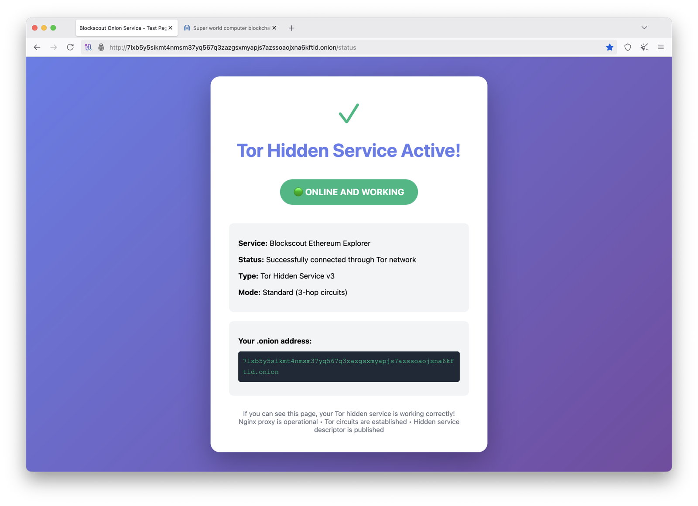

# Troubleshooting Guide

## Check Container Logs

```bash
# View all logs with live updates
docker compose logs -f

# View Tor logs only
docker compose logs -f tor

# View Nginx logs only
docker compose logs -f nginx

# View last 50 lines
docker compose logs --tail=50
```

## Wait for .onion Propagation

After starting, your .onion address needs to propagate through the Tor network. This typically takes **30-60 seconds**.

### Check Propagation Status

Check Tor logs for bootstrap progress:

```bash
docker compose logs tor | grep -i "bootstrapped"
```

You should see:
```
Bootstrapped 0% (starting): Starting
Bootstrapped 5% (conn): Connecting to a relay
...
Bootstrapped 100% (done): Done
```

### Verify Descriptor Publishing

After 100% bootstrap, check for successful descriptor publishing:

```bash
docker compose logs tor | grep -i "descriptor"
```

Look for messages like:
```
[notice] Uploaded rendezvous descriptor
```

## Test the Status Page

The setup includes a `/status` endpoint to verify the proxy is working:

```bash
# From your host machine (if you have Tor running locally)
curl -x socks5h://localhost:9050 http://your-address.onion/status
```

Or visit in Tor Browser:

**Status Page:**


**Blockscout via Onion:**


## Common Issues

### Issue: Container Immediately Exits

```bash
# Check logs for errors
docker compose logs tor
docker compose logs nginx

# Verify file permissions
ls -la tor_data/hidden_service/
```

**Common causes**:
- Permission issues with `tor_data/` directory
- Invalid configuration in `torrc` or `nginx.conf`
- Port conflicts

### Issue: Can't Connect to .onion Address

```bash
# Verify bootstrap completed
docker compose logs tor | grep "100%"

# Check if nginx is reachable from tor container
docker exec blockscout-tor wget -O- http://nginx:8080/status

# Verify containers are healthy
docker compose ps
```

**Common causes**:
- Tor hasn't finished bootstrapping (wait 30-60 seconds)
- .onion address hasn't propagated through network yet
- Tor Browser not configured correctly
- Network/firewall blocking Tor connections

### Issue: Proxy Returns Errors

```bash
# Test upstream connectivity from nginx container
docker exec blockscout-nginx wget -O- http://5.9.87.214:80 | head

# Check nginx error logs
docker compose logs nginx | grep error
```

**Common causes**:
- Upstream service (5.9.87.214) is down or unreachable
- Nginx configuration incorrect
- Network issues between containers and upstream service
- Upstream service blocking requests

## Health Check Failures

If containers show as "unhealthy":

```bash
# Check what the health check is testing
docker inspect blockscout-tor | grep -A 5 Healthcheck
docker inspect blockscout-nginx | grep -A 5 Healthcheck

# Manually run the health check command
docker exec blockscout-tor pgrep tor
docker exec blockscout-nginx wget --quiet --tries=1 --spider http://127.0.0.1:8080/status
```

## Permission Issues

If you encounter permission errors:

```bash
# Fix ownership of tor_data directory
sudo chown -R $(id -u):$(id -g) tor_data/

# Fix permissions
chmod 700 tor_data/hidden_service
chmod 600 tor_data/hidden_service/*
```

## Network Issues

### Test Container Connectivity

```bash
# Test if containers can communicate
docker exec blockscout-tor ping -c 3 nginx
docker exec blockscout-nginx ping -c 3 tor

# Check network configuration
docker network inspect blockscout-onion_tor-network
```

### Test External Connectivity

```bash
# From nginx container
docker exec blockscout-nginx wget -O- http://5.9.87.214:80 | head

# From tor container
docker exec blockscout-tor wget -O- http://nginx:8080/status
```

## Viewing Detailed Tor Information

```bash
# Check Tor version
docker exec blockscout-tor tor --version

# View full Tor configuration
docker exec blockscout-tor cat /etc/tor/torrc

# Check Tor process
docker exec blockscout-tor ps aux | grep tor
```

## Debugging Tips

1. **Enable debug logging in Tor**: Edit `torrc` and change `Log notice stdout` to `Log debug stdout`, then rebuild
2. **Enable debug logging in Nginx**: Edit `nginx.conf` and set `error_log /dev/stderr debug;`
3. **Monitor logs in real-time**: `docker compose logs -f` in a separate terminal
4. **Check resource usage**: `docker stats` to see CPU/memory usage
5. **Verify DNS resolution**: Ensure upstream service hostname resolves correctly

## Getting Help

If you're still experiencing issues:

1. Check the [CI.md](../CI.md) for automated testing procedures
2. Review recent [GitHub Issues](https://github.com/igor53627/blockscout-onion/issues)
3. Open a new issue with:
   - Full output of `docker compose logs`
   - Your configuration files (remove sensitive data)
   - Steps to reproduce the problem
   - Your environment (OS, Docker version)
